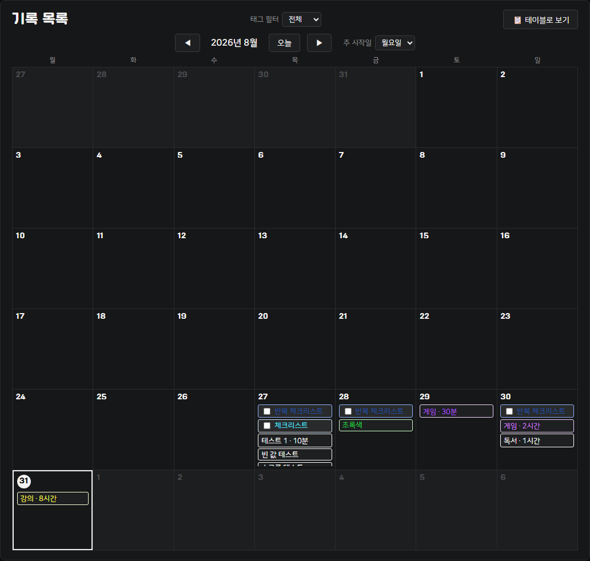
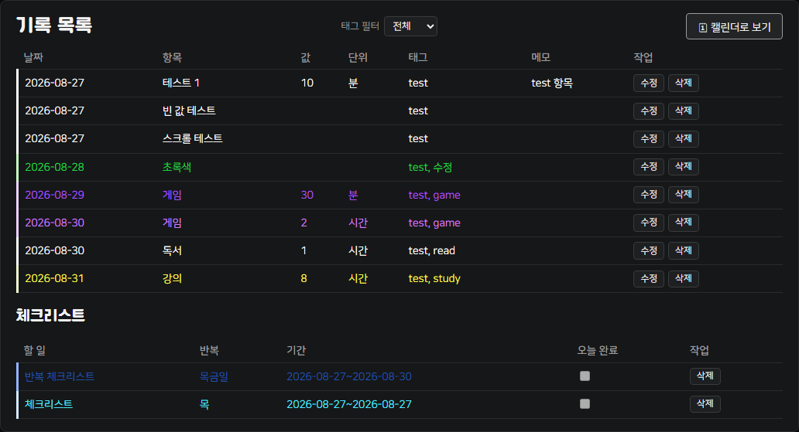

# plan_record — 플랜두씨 다이어리

계획(Plan) → 실제로 한 일(Do) → 돌아보기(See)가 하나로 이어지는 다이어리. 화면 위 모드 전환 버튼으로 두 기능을 오간다.

> ⏳ **T07 진행 중 (2026-09-01~)**: T06(로그인 없는 버전)에 이어 Supabase Auth로 로그인을 붙이는 중이다. 첫 화면이 로그인 화면으로 바뀌고, 계획 다이어리의 자료는 로그인한 계정에만 보인다. DB 마이그레이션(`supabase/migration-t07-auth.sql`) 적용 전까지는 배포 화면에 반영하지 않는다 — 자세한 진행 상황은 [PROGRESS.md](PROGRESS.md), 과제 원문은 [ASSINGMENT.md](ASSINGMENT.md), T06 문서 전체는 [archive/t06/](archive/t06/) 참고.

- **계획 다이어리 (Plan·Do·See)** — 기본 화면. 계획·할 일·실행 기록·돌아보기를 Supabase(Postgres) 서버 데이터베이스에 저장한다. (T07 적용 후) 로그인한 계정에만 보이고, Row Level Security로 다른 계정의 자료는 서버에서부터 막힌다.
- **투두 기록기** — 예전 카드1~5 과제로 만든 개인 습관 기록기. 백엔드 없이 `localStorage`만으로 동작하며, 합성(가상) 데이터만 사용하는 원칙을 그대로 유지한다.

**공개 주소**: https://whiteclover0542.github.io/plan_record/

## 계획 다이어리 (Plan·Do·See)

- 계획: 기간·우선순위·성공 기준·예상 시간을 저장하고, 고쳐도 고치기 전 내용이 `plan_revisions`에 자동으로 남는다.
- 할 일: 생성·수정·완료/되돌리기·삭제(소프트 삭제), 검색·태그/상태 필터·정렬(마감일/우선순위/등록순).
- 실행 기록: 시작·종료 시각, 실제 걸린 시간, 막힌 이유를 계획과 별개로 저장 — 계획의 예상값은 절대 덮어쓰지 않는다. 완료 버튼을 연달아 눌러도 기록·집계는 한 번만 늘어난다(DB RPC의 조건부 UPDATE로 보장).
- 돌아보기: 계획 수·완료 수·지연 수·막힘 수와 예상/실제/차이 시간을 집계하고, 숫자를 눌러 근거 기록으로 드릴다운할 수 있다. 돌아보기 메모는 다음 계획으로 이어받을 수 있다.
- 저장소: Supabase(Postgres) 서버 DB. 클라이언트에는 anon(public) key만 두고, 실제 접근 제어는 서버 쪽 RLS 정책이 담당한다.
- 자료 전체를 JSON 파일 하나로 내보낼 수 있다.

세부 스키마는 [contracts/pds-schema-v2.json](contracts/pds-schema-v2.json), DDL 원본은 [supabase/schema.sql](supabase/schema.sql) 참고.

## 투두 기록기 (예전 카드1~5)

계획한 나와 실제의 나를 비교하는 개인 기록기. 습관, 운동, 게임, 학습 시간 등 원하는 항목을 기록·수정·삭제하고, 캘린더/테이블로 다시 확인한다. 백엔드 없이 순수 HTML/CSS/JS + `localStorage`만으로 동작한다.

### 미리보기

캘린더 뷰



테이블 뷰 (전체 목록 + 체크리스트)



> 위 화면은 전부 `test` 태그를 붙인 합성(가상) 데이터다. 더 많은 스크린샷은 [SUBMISSION.md](SUBMISSION.md) 참고.

### 주요 기능

- 기록 생성·조회·수정·삭제 (고유 ID 기준, 캘린더/테이블 뷰)
- 반복·단발성 체크리스트 (요일 반복, 기간 설정, 오늘 완료 체크)
- 태그 필터링, 캘린더 칩 색상 커스터마이즈 + 중요 기록 강조 표시(굵게·★)
- JSON 내보내기/가져오기(전체 복원), 전체 삭제
- 구버전(v1) 기록을 새 필드(`tags`, `schemaVersion`)로 자동 변환(멱등)
- 주간 요약(월요일~일요일, `Asia/Seoul` 기준) — 잘못된 날짜·필수값 누락·중복 id·비숫자 값은 집계에서 제외하고 사유를 표시

### 데이터 구조

기록 한 건 = 언제(`date`, `Asia/Seoul` 기준) / 무엇을(`item`) / 얼마나(`value`, `unit`)를 나타낸다. 필드 정의와 v1→v2 변환 규칙은 [PROGRESS.md](PROGRESS.md#부록-필드-정의-카드1-확정)에 정리돼 있다.

## 로컬에서 실행

빌드 과정이 필요 없다. 저장소를 내려받은 뒤 정적 파일 서버로 열면 된다.

```bash
python -m http.server 8000
# http://localhost:8000 접속
```

`index.html`을 브라우저로 직접 열어도 동작하지만, 파일을 그대로 열면(`file://`) 브라우저에 따라 동작이 달라질 수 있어 로컬 서버 사용을 권장한다.

계획 다이어리(Plan·Do·See)는 Supabase 서버로 REST 호출을 하므로 인터넷 연결이 필요하다. 연결 정보는 [config.js](config.js)의 anon(public) key로 고정돼 있다 — 별도 설정 없이 그대로 동작한다.

## 문서

- [ASSINGMENT.md](ASSINGMENT.md) — T07 과제 요구사항 원본(동결)
- [PROGRESS.md](PROGRESS.md) — T07 진행 상태, 설계 결정 이력, curl 테스트 근거, 검증 안내서/설명서 초안
- [card5-log.md](card5-log.md) — T07 5일 실사용 로그(로그인한 계정 기준, 날짜·지표 값 위주, 개인 기록 원문은 비공개)
- [archive/t06/](archive/t06/) — T06(로그인 없는 버전) 요구사항·진행 문서·최종 제출 문서 전체 보존
- T07 최종 SUBMISSION 문서는 5일 로그·인증 구현 설명서 완료 후 작성 예정

## 개인정보·보안 원칙

- 계획 다이어리(Plan·Do·See)는 이제 로그인이 걸려 있다 — 내 계획·할 일·실행 기록은 로그인한 내 계정에만 보이고, RLS가 서버에서 다른 계정의 접근을 막는다.
- 투두 기록기 쪽은 예전 원칙대로 실제 개인 기록은 각자의 브라우저(`localStorage`)에만 남고, 이 저장소·공개 화면·제출 문서에는 합성(가상) 데이터만 사용한다.
- 클라이언트 코드에는 Supabase anon(public) key만 있고 `service_role` 키 등 비밀값은 어디에도 없다. 로그인 세션(JWT)은 브라우저에만 저장되고, 제출 문서에 요청/응답 예시를 남길 때 토큰·비밀번호는 항상 가려서 적는다.
