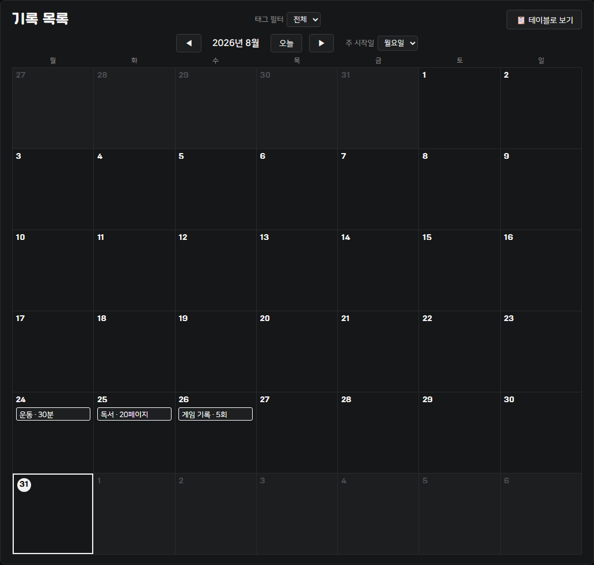
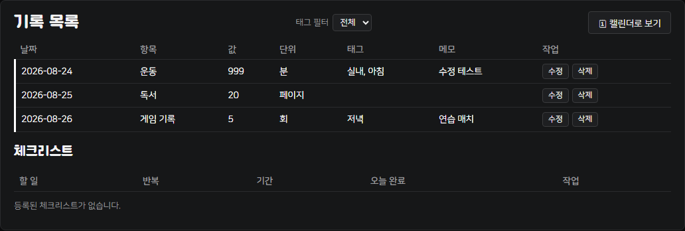
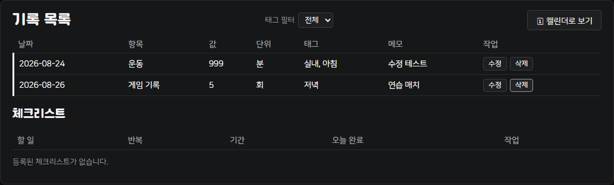
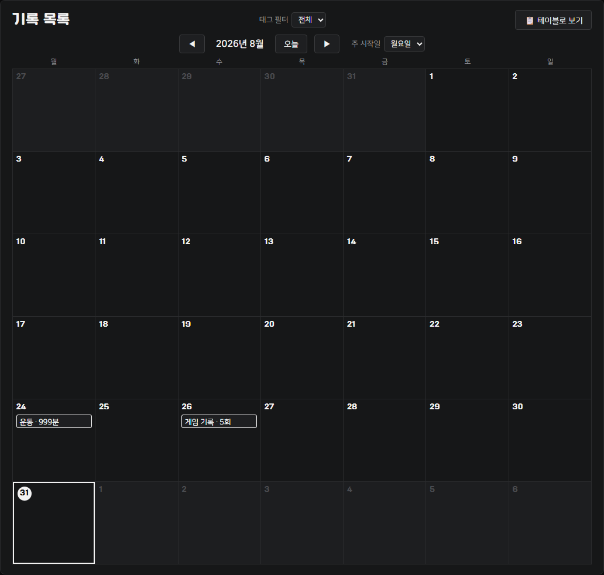
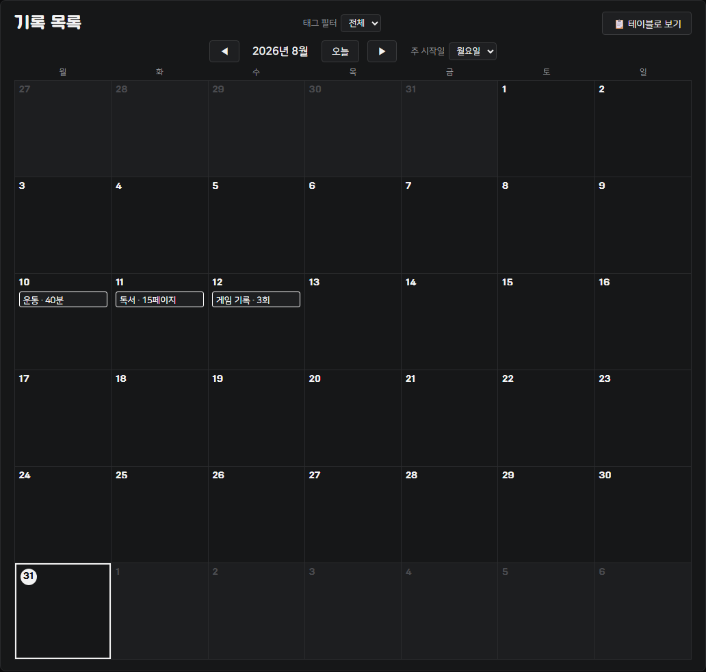
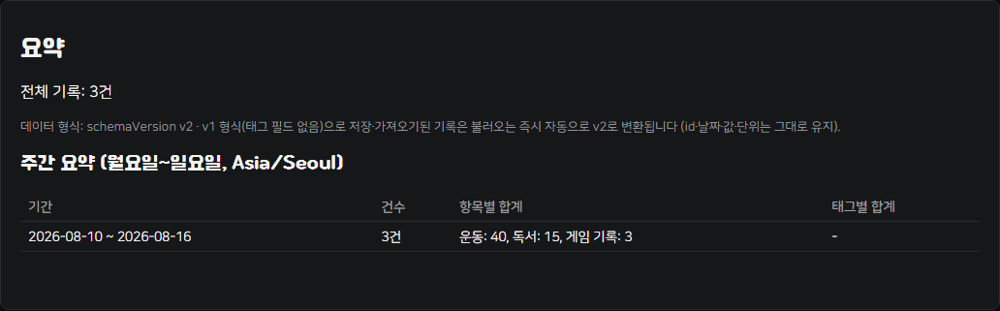
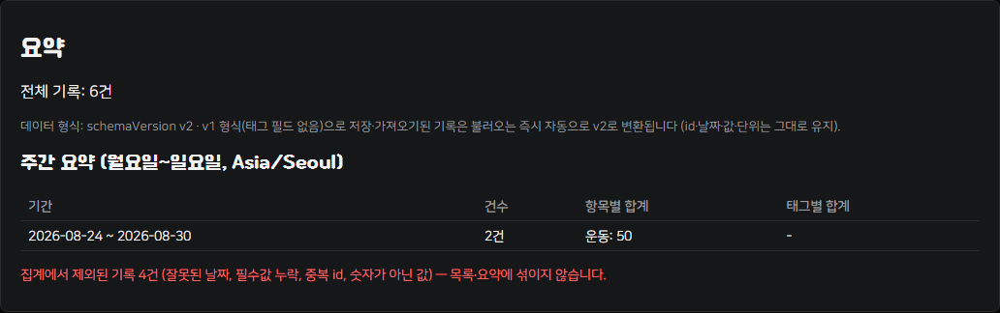
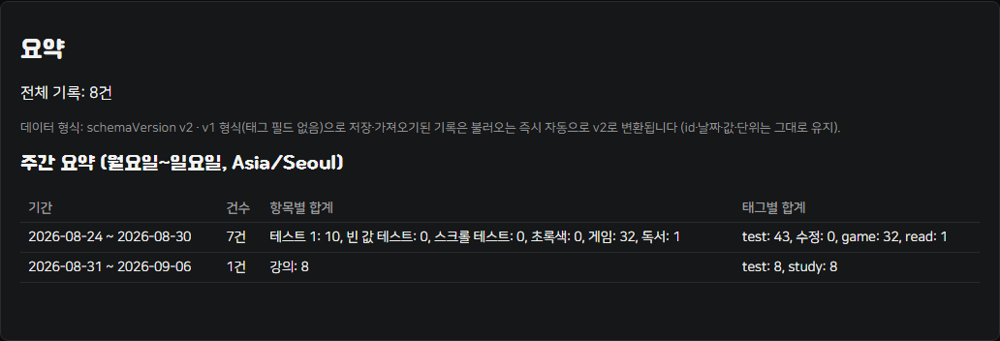
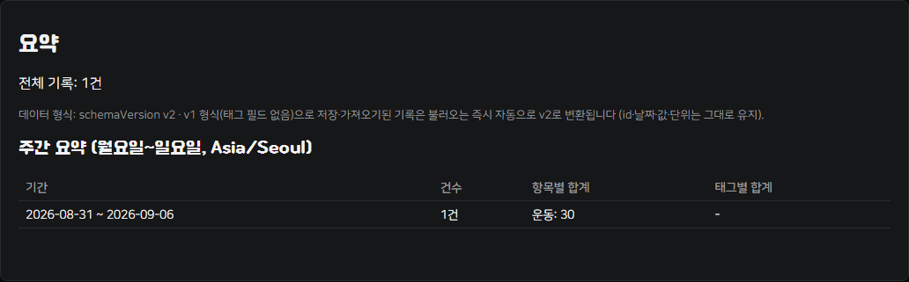
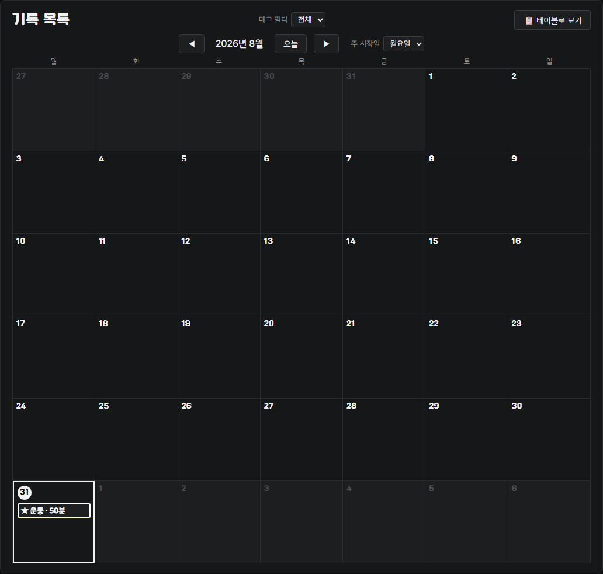

# T06 플랜두씨 다이어리 1 — 제출 문서

> PDF 변환 전 정리용 마크다운. 원본 요구사항은 [ASSINGMENT.md](ASSINGMENT.md), 작업 이력은 [PROGRESS.md](PROGRESS.md), 5일 실사용 로그는 [card5-log.md](card5-log.md) 참고.
> 아래 스크린샷은 모두 "합성 기록 3건 채우기" 또는 직접 입력한 **합성(가상) 데이터**로 재현했다. 실제 개인 기록(PC 전용)은 여기 포함하지 않는다.

## 실사용 화면 (한눈에 보기)

카드1을 마친 날부터 서로 다른 실제 날짜 5일(8/27~8/31)간 사용한 화면이다. 기록 8건 + 반복 체크리스트 2건이 남아 있고, 모두 `test` 태그를 붙인 가상 기록("테스트 1", "게임", "독서", "강의" 등)이다. 8/28에 일부러 심어둔 "초록색" 기록(항목명·표시 색상 불일치)은 5일째에 실제 색상을 초록으로 맞춰 수정한 뒤의 상태다.

캘린더 뷰

테이블 뷰 (전체 목록 + 체크리스트)

## 공개 주소

https://whiteclover0542.github.io/plan_record/

## 검증 안내서

**어디로 가나요**
https://whiteclover0542.github.io/plan_record/

**무엇을 하나요** (3단계)
1. 캘린더에서 아무 날짜 칸을 보고, 왼쪽 "기록 추가" 폼에 날짜·항목·값·단위를 입력한 뒤 "추가"를 누른다.
2. 방금 생긴 칸을 클릭해 상세 모달을 열고 "수정"으로 값을 바꿔 저장하거나 "삭제"를 눌러본다.
3. 화면 아래 "요약" 영역에서 전체 건수와 주간 요약(항목별 합계)이 방금 한 동작에 맞춰 함께 바뀌는지 확인한다.

**무엇이 보이면 통과인가요**
- 추가·수정·삭제 직후 목록(캘린더/테이블) 행과 "요약" 영역의 건수·주간 요약이 같은 화면에서 함께 바뀐다
- "내보내기·가져오기·전체 삭제" 영역에 세 버튼과, 손상된 파일을 가져올 때 오류 문구가 보인다
- "주간 요약" 표에 기간(월요일~일요일)과 항목별 합계가 보이고, 잘못된 날짜·값은 별도 "집계에서 제외된 기록" 문구로만 표시된다
- 화면 어디에도 실제 개인 기록·이름·연락처 같은 정보 없이 합성(가상) 데이터만 보인다

**안 될 때**
- 오류 문구: 날짜·항목을 비운 채 "추가"를 누르면 폼 아래 빨간 글씨로 "날짜, 항목은 비워둘 수 없습니다." 등이 뜬다 — 필수값을 채우면 해결된다
- 확인할 항목: 브라우저가 시크릿(사생활 보호) 모드이거나 localStorage를 막아둔 경우 기록이 저장되지 않을 수 있다 — 일반 창에서 열었는지 확인한다
- 복구 방법: "전체 삭제"로 비운 뒤 "합성 기록 3건 채우기" 버튼을 누르면 항상 같은 예시 데이터로 되돌아온다

## AI 3줄

- **AI에게 맡긴 일**: CRUD·내보내기/가져오기·v1→v2 변환·주간 요약·카드5 개선(기록별 "중요 표시(굵게+★)") 등 `app.js`/`ui.js` 구현 전체를 AI에게 맡겼다.
- **내가 판단한 일**: 필드 정의, 기준 시간대(`Asia/Seoul`)·주 시작 요일(월요일), 공개용 데이터는 합성 데이터만 쓴다는 원칙, 그리고 5일 실사용 중 반복된 불편(캘린더·목록에서 어떤 기록이 중요한지 구분이 안 됨)으로 무엇을 고칠지는 직접 정했다.
- **AI 말을 안 들은 일**: 날짜 검증에서 AI가 제안한 `Date.parse` 방식을 쓰지 않았다 — `2026-02-30`처럼 존재하지 않는 날짜가 3월로 밀려 통과되는 문제가 있어, 왕복 검증하는 `isValidDateString`을 직접 만들어 대신 썼다. 카드5에서도 AI가 처음 넣은 "굵게만" 처리로는 눈에 잘 안 띄어, 별 표시(★)·테두리 강조를 더 넣게 했다.

---

## 카드별 증거

### 카드 1 — 기록의 구조 (생성·조회·수정·삭제)

"합성 기록 3건 채우기"로 3건을 추가하고, 한 건을 수정, 한 건을 삭제했다. 목록(캘린더)이 매 동작마다 바로 갱신된다.

**추가**

**수정** (운동 기록의 값을 999·메모를 "수정 테스트"로 변경)

**삭제** (독서 기록 삭제, 2건만 남음)

### 카드 2 — 내보내기와 전체 삭제

새로고침 후에도 기록이 그대로 유지되고, 손상된 파일을 가져오면 기존 기록을 바꾸지 않은 채 오류 문구만 보인다.

**새로고침 전·후 동일** (2건 → 새로고침 → 2건)

**손상 파일 가져오기 거부** (JSON이 아닌 파일 업로드 시 기존 기록 유지 + 오류 문구)

### 카드 3 — 기존 기록을 잃지 않는 변경 (v1 → v2 자동 변환)

[fixtures/v1-sample.json](fixtures/v1-sample.json)(`schemaVersion` 없는 v1 형식 3건)을 가져오기하면 id·날짜·값·단위는 그대로 유지된 채 자동으로 v2로 변환된다.

**v1 파일 가져오기 결과**

**변환 상태 안내 문구**

### 카드 4 — 날짜와 잘못된 값 (경계·오류 자료가 집계를 오염시키지 않음)

저장소에 아래 6건을 직접 주입해(UI 정상 경로로는 애초에 저장되지 않는 값들) 방어 로직을 검증했다.

| 항목 | 값 | 처리 |
|---|---|---|
| 월요일 경계 (`2026-08-24`) | 운동 30분 | 집계 포함 |
| 일요일 경계 (`2026-08-30`) | 운동 20분 | 집계 포함 |
| 필수값 누락 | item 빈 문자열 | 제외(사유 표시) |
| id 중복 | 동일 id 재사용 | 제외(사유 표시) |
| 잘못된 날짜 | `2026-02-30`(실존하지 않음) | 제외(사유 표시) |
| 비숫자 값 | `"abc"` | 제외(사유 표시) |

**결과**: 유효한 2건만 "운동: 50"으로 정상 집계, 나머지 4건은 사유와 함께 집계에서 제외됨(오염 없음).

### 카드 5 — 5일 사용 후 한 가지 개선

- 5일간 서로 다른 실제 날짜(8/27~8/31)에 사용한 로그는 [card5-log.md](card5-log.md)에 있다. 항목은 전부 `test` 태그를 붙인 가상 기록("테스트 1", "게임", "독서", "강의" 등)으로, 실제 개인 기록이 아니다. 캘린더·테이블 화면은 맨 위 "실사용 화면" 참고.
- 반복된 불편: 캘린더·목록에서 어떤 기록이 "중요한" 기록인지 구분할 방법이 없었다 → 기록별 **"중요 표시(굵게 + ★)"** 옵션을 추가했다.
- 5일째, 8/28에 일부러 심어뒀던 기록 1건(항목명은 "초록색"인데 표시 색상은 어긋나 있던 기록)을 찾아 실제 표시 색상을 초록으로 맞춰 수정했다.

**요약** (전체 8건, 주간 요약에 항목별·태그별 합계)

아래는 "잘못 입력한 값을 고치면 행 + 주간 요약이 함께 바뀐다"는 카드5 통과 기준을, 값이 바뀌는 경우로 한 번 더 재현한 것이다 — "운동 30분"으로 잘못 입력했던 기록을 "운동 50분"으로 고치면서 동시에 "중요 표시"도 켰다.

**수정 전** — 목록과 주간 요약(운동: 30)

**수정 후** — 값이 50으로 바뀌고 ★로 중요 표시됨, 주간 요약도 운동: 50으로 함께 갱신

---

## 필수 검증·보안 계약 체크

| 항목 | 상태 | 근거 |
|---|---|---|
| 고유 ID로 정확한 한 건만 수정·삭제 | ✅ | `Records.update`/`remove`는 항상 `id`로 대상을 찾음 (카드1 스크린샷) |
| 필수값 빈 기록은 저장 안 함 | ✅ | `validateRecordInput` — 날짜·항목 필수 |
| 새로고침 뒤 기록 수·값 유지 | ✅ | 카드2 새로고침 전·후 스크린샷 |
| 내보낸 파일에서 ID·날짜·값·단위 복원 | ✅ | `ImportExport.exportJSON`/`parseImport` |
| 전체 삭제 뒤 0건 | ✅ | `Records.removeAll()` |
| 손상 파일은 기존 기록 유지 + 오류 표시 | ✅ | 카드2 손상 파일 스크린샷 |
| v1·v2 변환 뒤 건수·값 유지 | ✅ | 카드3 스크린샷 |
| 변환 2회 실행해도 안 늘어남(멱등) | ✅ | `migrateRecordToV2`는 이미 v2면 그대로 반환 |
| 기준 시간대·주 시작 요일 명확 | ✅ | `Asia/Seoul` 고정, 월요일 시작 |
| 날짜 경계·누락·중복·잘못된 값 규칙대로 처리, 집계에 안 섞임 | ✅ | 카드4 스크린샷 |
| 실제 개인 기록은 PC에만, 공개·제출은 합성 데이터만 | ✅ | 이 문서·저장소 스크린샷 전부 합성 데이터, [card5-log.md](card5-log.md)는 날짜·완료 여부만 |
| 개인정보·비밀값 0건 | ✅ | 백엔드 없음(순수 프론트엔드), 비밀값 자체가 존재하지 않음 |
| 5일 대기 시간은 작업시간에서 제외 | ✅ | [card5-log.md](card5-log.md) 진행 체크 |
