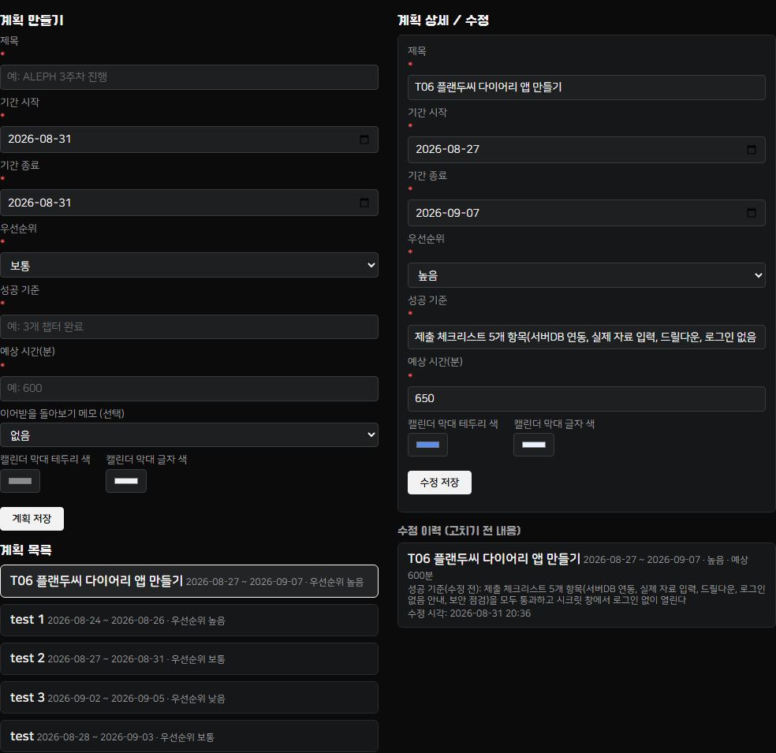
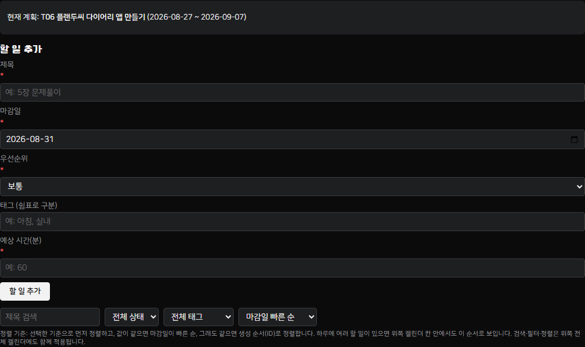
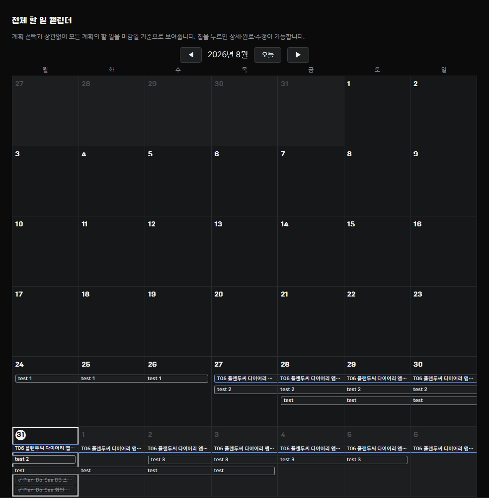
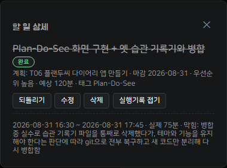
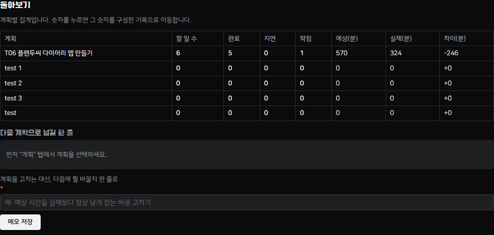
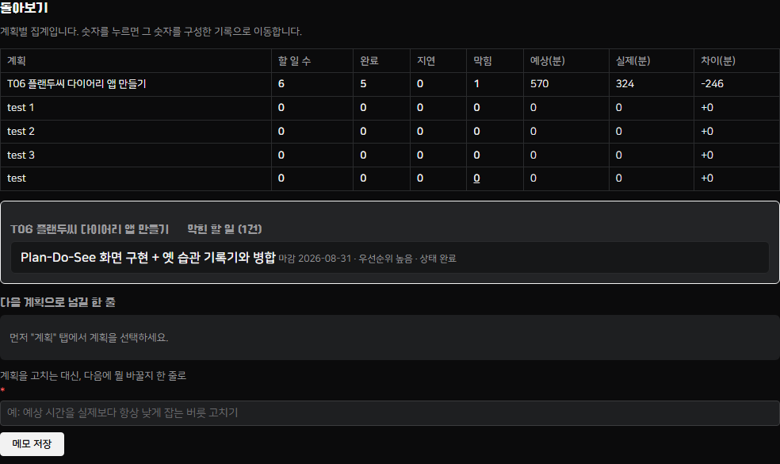
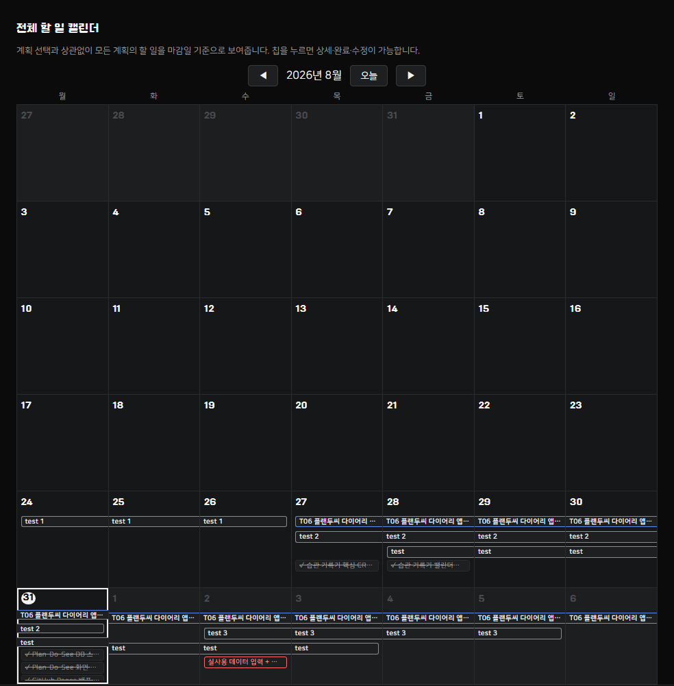
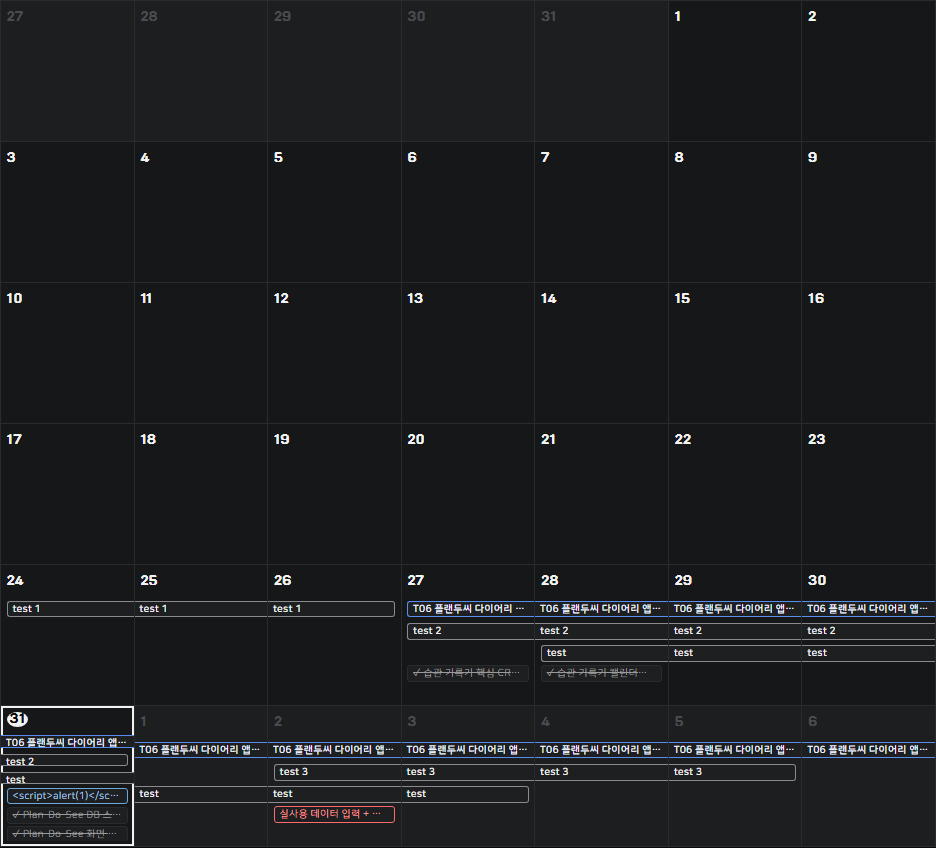

# T06 플랜두씨 다이어리 1 — 제출 문서

> 2026-08-31: 과제 요구사항이 습관 기록기(카드1~5)에서 계획(Plan)-할일(Todo)-실행기록(Do)-돌아보기(See)로 바뀌면서, 이 문서도 새 요구사항에 맞춰 다시 작성했다. 이전 버전(습관 기록기 카드1~5의 스크린샷 포함 문서)은 git 이력에 그대로 남아 있다. 작업 근거·설계 결정·자동 테스트 이력은 [PROGRESS.md](PROGRESS.md) 참고.
> 아래 스크린샷은 모두 배포된 실제 주소(https://whiteclover0542.github.io/plan_record/)에서, 실제로 입력한 데이터("T06 플랜두씨 다이어리 앱 만들기" — 이 앱을 만드는 실제 작업 자체를 계획으로 등록)를 그대로 찍었다. 합성 데이터가 아니다.

## 결과물 주소

https://whiteclover0542.github.io/plan_record/

로그인 없이 열리고, 기본 화면이 "계획 다이어리 (Plan·Do·See)" 모드다. 화면 위 버튼으로 옛 "투두 기록기"(습관 기록기, 카드1~5) 모드로도 전환할 수 있다.

## 소스 주소

https://github.com/whiteclover0542/plan_record/tree/860a65e573b25311e0346ef532e2bff359e7f885

브랜치·저장소 첫 화면이 아니라, 이 커밋(전체 40자리 소문자 SHA) 시점의 소스 상태를 그대로 가리키는 고정 URL이다. 공개(Public) 저장소, 로그인 없이 열린다.

---

## 카드별 증거 — 5장 전부 완료

### 카드 1 — 계획 세우기 ✅

지금 실제로 하고 있는 일(이 앱을 만드는 작업 자체)을 계획으로 등록했다. 기간·우선순위·성공 기준·예상 시간이 저장되고, 계획을 한 번 고친 뒤(예상 시간 600분 → 650분, 실제로 습관 기록기 병합 작업 때문에 범위가 늘어난 걸 반영) 고치기 전 내용이 "수정 이력"에 그대로 남는다.

오른쪽 "계획 상세/수정"에 현재 값(예상 650분)이, 아래 "수정 이력"에 고치기 전 값(예상 600분, 수정 전 성공 기준 문구, 수정 시각)이 그대로 보존돼 있다.

- [x] T06-C04 기간 저장 · [x] T06-C05 우선순위 저장 · [x] T06-C06 성공 기준 저장 · [x] T06-C07 예상 시간 저장 · [x] T06-C08 수정 이력 보존

### 카드 2 — 할 일 다루기 ✅

계획에 딸린 할 일 6개(완료 5개·진행중 1개)를 등록했다. 제목·마감일·우선순위·태그·예상 시간을 저장하고, 검색·태그 필터·상태 필터·정렬을 지원한다. 검색·필터·정렬은 위쪽 "전체 할 일 캘린더"에 곧바로 반영된다(화면에 정렬 기준 문구 고정 표시).

태그를 "Plan-Do-See"로 걸러보면, 캘린더에 그 태그가 붙은 할 일 2건만 남고 나머지(습관기록기 태그 등)는 숨는다.

- [x] T06-C09~C13 생성·수정·완료·되돌리기·삭제 · [x] T06-C14~C17 마감일·우선순위·태그·예상시간 저장 · [x] T06-C18 검색 · [x] T06-C19 필터 · [x] T06-C20 정렬(기준 문구 화면 고정)

### 카드 3 — 실제로 한 일 적기 ✅

완료한 할 일마다 실행 기록(시작·종료 시각, 실제 걸린 시간, 막힌 이유)이 계획과 별개로 남는다. 예를 들어 "Plan-Do-See 화면 구현 + 옛 습관 기록기와 병합" 항목은 실제로 작업 중 습관 기록기 파일을 통째로 삭제했다가 되돌린 사건이 있었는데, 그 사실을 막힌 이유에 그대로 적었다.

완료 버튼(RPC `complete_todo`)은 조건부 UPDATE(`WHERE status <> 'done'`)로 멱등 처리되어 연달아 눌러도 실행 기록·집계가 한 번만 늘어난다(자동 테스트로 확인, [PROGRESS.md](PROGRESS.md) 참고).

- [x] T06-C23~C26 시작·종료 시각·실제 시간·막힌 이유 저장 · [x] T06-C27 계획 값 불변 · [x] T06-C21/C22 완료 중복 방지

### 카드 4 — 돌아보기, 그리고 다음 계획으로 ✅

계획별로 할 일 수·완료 수·지연 수·막힘 수와 예상/실제/차이 시간을 집계한다. 숫자를 누르면 그 숫자를 구성한 실제 기록으로 드릴다운된다.

계획 6 · 완료 5 · 지연 0 · 막힘 1 · 예상 570분 · 실제 324분 · 차이 -246분. "막힘" 숫자(1)를 클릭하면 근거가 된 할 일로 바로 이동한다.

"다음 계획으로 넘길 한 줄" 기능(돌아보기 메모 → 새 계획 생성 폼 드롭다운 → `carried_note_id`로 실제 DB 연결)은 자동 테스트로 검증했다(스크린샷은 합성 데이터 기준, [PROGRESS.md](PROGRESS.md) 카드4 참고).

- [x] T06-C28~C31 집계값 정확 · [x] T06-C32 예상/실제/차이 계산 정확 · [x] T06-C83 드릴다운 · [x] T06-C33 다음 계획 이어받기

### 카드 5 — 내 것으로 채우고, 잃지 않게 ✅

**전체 할 일 캘린더** — 계획 기간이 이어진 막대로 표시되고, 그 아래 할 일 칩이 마감일별로 보인다.

(캘린더에 같이 보이는 `test`/`test 1~3`은 예전 캘린더 레인 기능을 테스트하며 남은 잔여 데이터다. `plans` 테이블은 설계상 anon 삭제 권한이 없어 — 계획 삭제 기능 자체를 두지 않기로 했다 — 코드로 지우지 못했다. 통과 기준인 "실제 계획 1개 이상"에는 지장이 없다.)

**로그인 없음 안내** — 첫 화면 헤더에 고정 표시된다.

**내보내기** — 전체 자료를 JSON 파일 하나로 내보낼 수 있다.

**스크립트 삽입 방어** — 할 일 제목에 ``를 실제로 저장해 배포 화면에서 재현했다. 대화상자(alert)가 뜨지 않고, 캘린더 칩에 글자 그대로 표시된다(확인 후 곧바로 삭제).

**새로고침 복원 / 시크릿 창** — Playwright로 배포 주소를 새 브라우저 컨텍스트(쿠키·로컬스토리지 없음, 시크릿 창과 동등)로 열어 로그인 절차 없이 로드되는지, 새로고침 전후 값이 같은지 확인했다(콘솔 에러 0건).

**비밀값 점검** — `config.js`에는 Supabase anon(public) key 하나만 있다. JWT payload를 디코드하면 `"role":"anon"`으로, 설계상 브라우저에 노출되는 게 정상인 공개 키다. `git log --all -p`로 저장소 전체 이력을 훑어도 `service_role`/`secret_key`/비밀번호 패턴은 문서 안 언급 외에는 없다.

- [x] T06-C34 서버 DB 저장 · [x] T06-C35 새로고침 복원 · [x] T06-C78~C81 실데이터(계획1+/할일5+/기록3+/집계≠0) · [x] T06-C36 내보내기 · [x] T06-C82 로그인 없음 안내 · [x] T06-C58 비밀값 없음 · [x] T06-C57 스크립트 리터럴 · [x] T06-C01 시크릿 창 접근

---

## 검증 안내서

① 어디로 가나요 — https://whiteclover0542.github.io/plan_record/ 접속(기본 화면이 "계획 다이어리 (Plan·Do·See)" 모드).
② 세 단계 안에 무엇을 하나요 — (1) 계획 목록에서 "T06 플랜두씨 다이어리 앱 만들기" 계획을 연다 (2) 할 일 탭에서 그 계획에 딸린 할 일 목록(완료 5개·진행중 1개)을 본다 (3) 돌아보기 탭으로 이동해 집계 숫자(예: 막힘 수 1) 중 하나를 클릭한다.
③ 무엇이 보이면 통과인가요 — 계획·할 일·실행 기록이 실데이터로 채워져 있고, 돌아보기 집계(계획 6·완료 5·지연 0·막힘 1·예상 570분·실제 324분·차이 -246분)가 0이 아니며, 숫자를 클릭하면 근거가 된 기록으로 이동한다.
④ 안 될 때는 무엇이 보이나요 — 목록이 "기록이 없습니다" 같은 빈 상태로 보이거나, 개발자 콘솔에 Supabase REST 요청 실패(네트워크 오류·CORS·401 등)가 찍힌다.

## AI와 내 판단 3줄

① AI에게 맡긴 일 — DB 스키마 설계, Supabase 연동 코드와 화면 구현, 자동화 테스트, 문서(README/PROGRESS) 정리, 그리고 실제 계획·할 일·실행 기록을 anon key REST API로 DB에 직접 입력하는 작업(무엇을 넣을지는 내가 지정).
② 내가 직접 판단한 일 — 실데이터로 어떤 계획을 넣을지(이 앱을 만드는 실제 작업 자체로 하기로 결정), 옛 습관 기록기를 지우지 않고 새 기능과 병합해서 유지할지, 운영 DB에 남아있던 예전 테스트 데이터를 지우고 진행할지 같은 방향 결정.
③ AI 제안을 따르지 않은 일 — 병합 초기에 AI가 옛 습관 기록기 파일(app.js/ui.js/checklist.js 등)을 전부 지우고 새 앱으로 통째로 교체했는데, 테마·형식·기능은 유지하고 새 기능만 얹으면 된다고 판단해 git에서 전부 되돌리고 다시 병합하도록 지시함.

---

## 완주 체크리스트

- [x] 계획 → 실제로 한 일 → 돌아보기가 서버 데이터베이스로 이어집니다.
- [x] 내가 실제로 세운 계획과 할 일과 실행 기록이 들어 있습니다.
- [x] 집계 숫자를 눌러 그 숫자가 나온 기록으로 갈 수 있습니다.
- [x] 아직 로그인이 없다는 안내가 첫 화면에 적혀 있습니다.
- [x] 최종 소스, 스크립트 삽입, 비밀값 노출, 외부 공개 여부를 확인했습니다.

## 마무리 체크리스트 (카드별 통과 기준 T06-C## 전체 — 전부 통과)

| 카드 | 통과 기준 | 상태 |
|---|---|---|
| 1 | C04 기간 저장 | ✅ |
| 1 | C05 우선순위 저장 | ✅ |
| 1 | C06 성공 기준 저장 | ✅ |
| 1 | C07 예상 시간 저장 | ✅ |
| 1 | C08 수정 이력 보존 | ✅ |
| 2 | C09 생성 | ✅ |
| 2 | C10 수정 | ✅ |
| 2 | C11 완료 처리 | ✅ |
| 2 | C12 완료 되돌리기 | ✅ |
| 2 | C13 삭제 | ✅ |
| 2 | C14 마감일 저장 | ✅ |
| 2 | C15 우선순위 저장 | ✅ |
| 2 | C16 태그 저장 | ✅ |
| 2 | C17 예상 시간 저장 | ✅ |
| 2 | C18 검색 | ✅ |
| 2 | C19 필터 | ✅ |
| 2 | C20 정렬(기준 명시) | ✅ |
| 3 | C21 완료 중복 방지(기록 1건) | ✅ |
| 3 | C22 완료 중복 방지(집계 1회) | ✅ |
| 3 | C23 시작 시각 저장 | ✅ |
| 3 | C24 종료 시각 저장 | ✅ |
| 3 | C25 실제 시간 저장 | ✅ |
| 3 | C26 막힌 이유 저장 | ✅ |
| 3 | C27 계획 값 불변 | ✅ |
| 4 | C28 계획 수 정확 | ✅ |
| 4 | C29 완료 수 정확 | ✅ |
| 4 | C30 지연 수 정확(중복 미포함) | ✅ |
| 4 | C31 막힘 수 정확 | ✅ |
| 4 | C32 예상/실제/차이 계산 정확 | ✅ |
| 4 | C83 드릴다운 | ✅ |
| 4 | C33 다음 계획 이어받기 | ✅ |
| 5 | C34 서버 DB 저장 | ✅ |
| 5 | C35 새로고침 복원 | ✅ |
| 5 | C36 전체 내보내기 | ✅ |
| 5 | C57 스크립트 리터럴(실행 안 됨) | ✅ |
| 5 | C58 비밀값 미노출 | ✅ |
| 5 | C59 검증 안내서 4단락 | ✅ |
| 5 | C60 AI 3줄 | ✅ |
| 5 | C78 실제 계획 1개 이상 | ✅ |
| 5 | C79 실제 할 일 5개 이상 | ✅ |
| 5 | C80 실제 실행 기록 3개 이상 | ✅ |
| 5 | C81 돌아보기 집계 0 아님 | ✅ |
| 5 | C82 로그인 없음 안내 | ✅ |
| 5 | C01 시크릿 창 접근 | ✅ |

세부 검증 근거(자동 테스트 로그, Playwright 확인 내역, DB 조회 결과 등)는 [PROGRESS.md](PROGRESS.md#마무리-체크리스트-카드별-통과-기준-하나하나-대조)에 있다.
